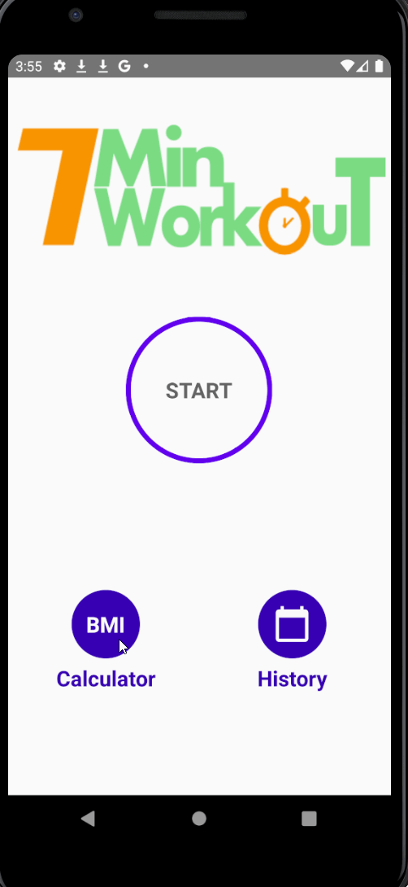

#*7MinuteWorkout*

**7MinuteWorkout** is an Android application that uses text-to-speech to guide the user through a series of workout routines

The following functionality is included:

* [x] Text-to-speech
* [x] A SQL database to record previous workouts
* [x] A BMI screen to calculate body mass index

## Video Walkthrough
Here's a walkthrough of implemented user stories:

GIF created with [LiceCap](http://www.cockos.com/licecap/).

